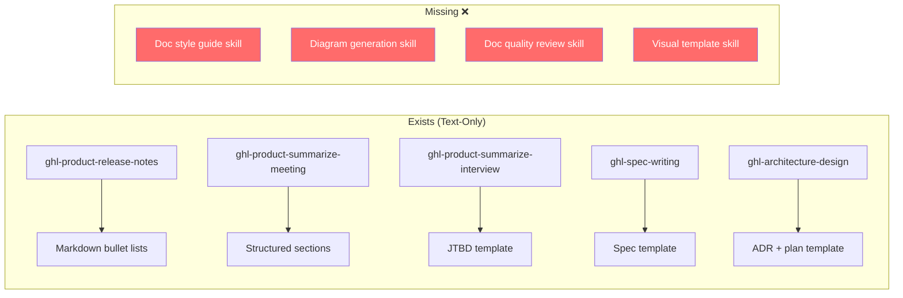
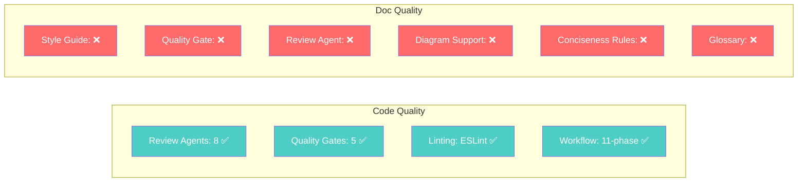

# Codebase Audit — Current Documentation & Readability Controls

> **TL;DR:** We have strong code quality enforcement (8 review agents, ESLint, quality gates) but almost zero documentation quality controls. Only 1 Mermaid diagram exists in the entire workspace. No agent has conciseness rules. No style guide exists.

---

## Architecture Overview

```mermaid
graph TD
    subgraph "Documentation Pipeline Today"
        A[25 AI Agents] -->|produce| B[Markdown Output]
        B -->|no quality check| C[Human Reads]
        C -->|cognitive overload| D[Slow Reviews]
    end

    subgraph "Code Pipeline Today (Mature)"
        E[Developer Agents] -->|produce| F[Code]
        F -->|checked by| G[8 Review Agents]
        G -->|enforced by| H[ESLint + Quality Gates]
        H -->|validated by| I[11-Phase Workflow]
    end

    style B fill:#ff6b6b,color:#fff
    style D fill:#ff6b6b,color:#fff
    style I fill:#4ecdc4,color:#fff
```



**The gap is clear:** Code has a mature quality pipeline. Documentation has none.

---

## Existing Agents Inventory

### Documentation-Producing Agents

| Agent | What It Produces | Has Format Rules? | Has Visuals? | Conciseness Rules? |
|-------|-----------------|:-----------------:|:------------:|:------------------:|
| `ghl-product-technical-writer` | API docs, runbooks, migration guides | Partial templates | None | "Write for 2am engineer" |
| `ghl-product-manager` | SPEC.md, PRDs | Template structure | None | None |
| `ghl-product-architect` | ADRs, architecture docs | Trade-off tables | ASCII text flows only | None |
| `ghl-product-frontend-developer` | Code + inline docs | SFC order rules | None | None |
| `ghl-product-backend-developer` | Code + inline docs | Layer structure | None | None |
| `ghl-product-unit-tester` | Test files + BDD specs | Gherkin format | None | None |
| `ghl-product-e2e-tester` | E2E tests + scenarios | Playwright POM | None | None |
| `ghl-product-design-reviewer` | Design audit reports | Checklist format | None | None |
| `ghl-product-release-engineer` | Deploy notes | Checklist format | None | None |

### Review Agents (Output = Findings Reports)

| Agent | Report Format | Consolidation? | Severity Standard? |
|-------|:------------:|:--------------:|:------------------:|
| `ghl-platform-maintainability-reviewer` | Prose + checklist | None | Own scale |
| `ghl-platform-architecture-reviewer` | Prose + findings | None | Own scale |
| `ghl-platform-performance-reviewer` | Prose + metrics | None | Own scale |
| `ghl-platform-reliability-reviewer` | Prose + findings | None | Own scale |
| `ghl-platform-security-reviewer` | Prose + findings | None | Own scale |
| `ghl-platform-frontend-core-reviewer` | Prose + checklist | None | Own scale |
| `ghl-platform-frontend-i18n-reviewer` | Prose + checklist | None | Own scale |

**Finding:** 7 review agents, each with independent formatting and severity scales. No consolidation layer.

---

## Existing Skills Inventory

### Documentation-Related Skills



### Quality-Related Skills

| Skill | What It Checks | Covers Docs? |
|-------|---------------|:------------:|
| `ghl-maintainability-review` | Code duplication, naming, i18n, SFC order | Code only |
| `ghl-code-review-pr` | 5 parallel reviewers orchestration | Code only |
| `ghl-security-review` | XSS, CSRF, auth, secrets | Code only |
| `ghl-performance-review` | Bundle size, CWV, lazy loading | Code only |
| `ghl-architecture-review` | Layer boundaries, SOLID | Code only |
| `ghl-reliability-review` | Error handling, type safety | Code only |

**Finding:** 6 review skills — ALL code-focused. Zero doc quality skills.

---

## Visualization Audit

### Current Mermaid Usage

| Location | Diagram Type | Context |
|----------|-------------|---------|
| `.agentic-workspace/commands/swarm.md` | `graph LR` flowchart | Task dependency visualization |

**That's it. 1 Mermaid diagram in the entire workspace.**

### Text-Based Visuals Found

| Agent/Skill | Visual Pattern | Example |
|------------|---------------|---------|
| `ghl-product-architect` | ASCII text notation | `[API Gateway] --> [Controller] --> [Service]` |
| `ghl-product-architect` | External tool command | `npx madge --image` for dependency graphs |

### Chart/Metric Visualization: **None**

No agent produces charts, graphs, or metric visualizations. Performance benchmarks use markdown tables only.

---

## Quality Gates Audit

### Existing Gates

| Gate | Script | What It Enforces | Covers Docs? |
|------|--------|-----------------|:------------:|
| ESLint Check | CI pipeline | TypeScript strictness, no `any`, imports | Code only |
| Redis Keys Check | CI pipeline | `locationId` in keys, no `KEYS *` | Code only |
| Mongo Index Check | CI pipeline | Compound indexes on queries | Code only |
| Mongoose v8 Check | CI pipeline | Schema best practices | Code only |
| Cross-Service Import | CI pipeline | No unauthorized imports | Code only |
| `validate-spec.sh` | `scripts/gates/` | Spec structure validation | Partial (structure only) |
| `check-design-fidelity.sh` | `scripts/gates/` | Design compliance | Design only |
| `run-quality-gates.sh` | `scripts/gates/` | Per-iteration quality | Code only |

**Finding:** No gate checks document readability, diagram presence, or conciseness.

---

## Formatting Rules Audit

### What Agents Say About Output Format

| Agent | Formatting Instruction | Effective? |
|-------|----------------------|:----------:|
| `ghl-product-technical-writer` | "Write for the engineer at 2am" | Directional but not measurable |
| `ghl-product-release-notes` | "Lead with user benefit, 1-3 sentences per entry" | Good for release notes only |
| `ghl-product-summarize-meeting` | "Use simple terms. Avoid jargon." | Good but limited scope |
| All developer agents | SFC order, naming conventions | Code formatting, not doc formatting |
| All review agents | Each has own template | Inconsistent across agents |

### What's Missing

```
❌ No shared output style guide
❌ No word/section length limits
❌ No TL;DR requirement
❌ No diagram requirement
❌ No domain glossary enforcement
❌ No paragraph length limits
❌ No "omit empty sections" rule
❌ No action-verb header convention
```

---

## Platform-Docs Gap Analysis

### Skills That Link to Missing Docs

| Skill | Links To | Exists? |
|-------|---------|:-------:|
| `ghl-maintainability-review` | `references/vue-sfc-structure.md` | No |
| `ghl-maintainability-review` | `references/translation-patterns.md` | No |
| `ghl-maintainability-review` | `references/code-review-checklist.md` | No |

**Finding:** Skills reference platform-docs that don't exist yet.

---

## Summary: Readiness Scorecard



| Area | Score | Status |
|------|:-----:|:------:|
| Code quality controls | 9/10 | Mature |
| Doc quality controls | 1/10 | **Critical gap** |
| Visualization capability | 0.5/10 | **Nearly absent** |
| Output consistency | 2/10 | **Each agent independent** |
| Conciseness enforcement | 1/10 | **No measurable rules** |

---

*This audit follows the proposed style: scorecard visuals, tables over prose, clear pass/fail verdicts.*
