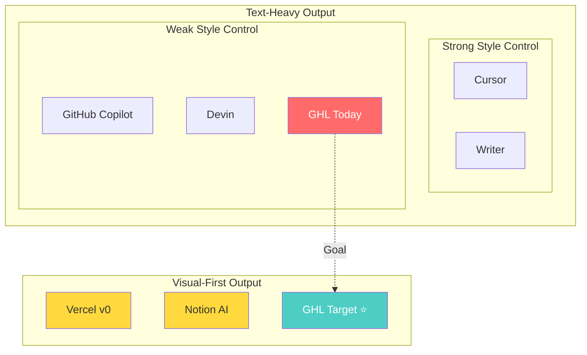
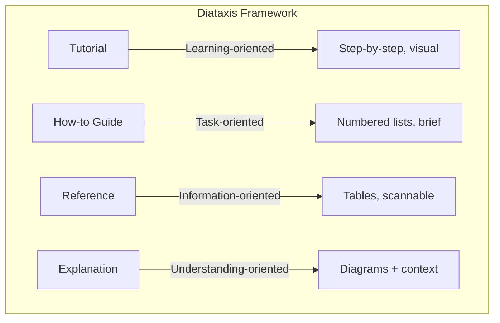
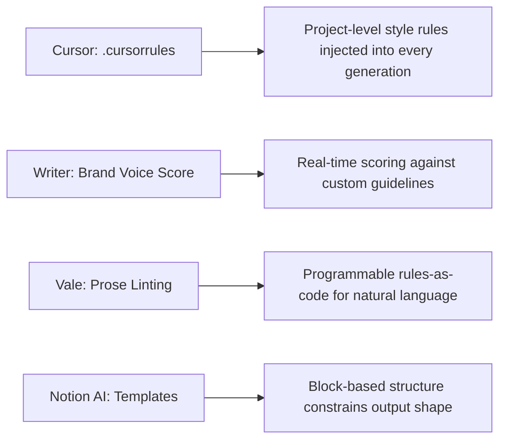
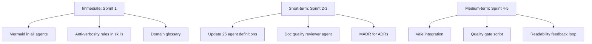

# Competitive Analysis — AI Output Readability

> **TL;DR:** No competitor treats readability as a first-class metric for multi-agent systems. Tools like Cursor (`.cursorrules`), Writer (brand voice scoring), and Vale (prose linting) solve pieces of the puzzle. We can own the full solution.

---

## Market Landscape

---

## Competitor Deep Dive

### AI Coding Agents

| | Cursor | Copilot | Devin | Codegen | Claude Code |
|---|--------|---------|-------|---------|------------|
| **Style enforcement** | `.cursorrules` file | `.github/copilot-instructions.md` | None | None | `CLAUDE.md` |
| **Codebase matching** | RAG over repo | File-level context | Full environment | Repo indexing | File reading |
| **Readability scoring** | None | None | None | None | None |
| **Post-gen linting** | User's existing linters | User's existing linters | Tests pass = done | Tests pass = done | User's existing linters |
| **Output format** | Inline diffs | Inline suggestions | Full files | PR-style diffs | Inline diffs |
| **Visual output** | None | None | Step-by-step logs | None | None |

**Key pattern:** Everyone relies on existing linters as the quality gate. Nobody scores readability.

### AI Writing/Doc Tools

| | Writer | Notion AI | Jasper | Mintlify |
|---|--------|-----------|-------|---------|
| **Style enforcement** | Custom style guide scoring | Tone controls | Brand voice training | Component library |
| **Readability scoring** | Real-time score vs guide | None | Brand voice score | None |
| **Template constraints** | Editorial workflows | Block-based structure | Template library | Callouts, tabs, cards |
| **Visual generation** | None | Basic formatting | None | Built-in components |
| **Technical doc support** | Weak | Weak | None | Strong (API docs) |

**Key pattern:** Writer is closest to what we need, but it's marketing-focused, not engineering-focused.

### Diagram/Visualization Tools

| Tool | AI Generation | Output Format | Integration |
|------|:------------:|--------------|-------------|
| **Mermaid** | LLMs generate natively | SVG in markdown | GitHub, VSCode, GitLab native |
| **D2** | LLMs generate well | SVG/PNG via CLI | CI pipeline rendering |
| **Eraser.io** | Text-to-diagram API | PNG/SVG | API callable from skills |
| **PlantUML** | LLMs generate well | SVG via server | Self-hosted or cloud |
| **tldraw** | Sketch-to-code | Canvas/SVG | Limited programmatic use |

**Recommendation:** Mermaid is P0 (zero infrastructure needed). D2 is P2 (better for complex diagrams but needs renderer).

---

## Documentation Frameworks

| Framework | Best For | Brevity Score | Visual Score | Fit for Us |
|-----------|---------|:------------:|:-----------:|:----------:|
| **Diataxis** | Doc categorization — prevents bloat | High | Medium | **Best fit** |
| **C4 Model** | Architecture docs — 4 zoom levels | High | **High** | Great for architect agent |
| **Arc42** | System docs — diagram-first sections | Medium | **High** | Good template source |
| **MADR** | Decision records — under 200 words | **Very High** | Medium | Replace current ADR format |
| **Amazon 1-Pager** | Executive summaries | **Very High** | Low | Good for leadership output |

---

## Anti-Verbosity Techniques (What Works)

### From Competitors

### Proven Patterns We Should Adopt

| Pattern | How It Works | Where to Apply |
|---------|-------------|---------------|
| **Template enforcement with hard limits** | "Context: MAX 3 sentences" in skill instructions | All agent SKILL.md files |
| **Diagram-first, text-second** | "Produce Mermaid FIRST. Only add text for what diagrams can't convey" | All architecture/flow documentation |
| **Linter-in-the-loop** | Run Vale after generation, auto-fix style violations | Quality gate script |
| **Diff minimization** | Constrain to smallest possible change | Developer agents |
| **Self-critique loops** | Agent reviews own output against readability checklist before presenting | Doc quality reviewer agent |
| **Structured progressive disclosure** | TL;DR → Summary → Detail → Deep-dive | All doc-producing agents |

---

## Gaps We Can Exploit

| Gap in Market | Our Opportunity |
|--------------|----------------|
| No multi-agent readability system | First to make readability a metric across 25+ agents |
| No diagram enforcement | Automated "every doc needs visuals" gate |
| No audience-aware calibration | Different output profiles per persona |
| No cross-agent consistency | Unified style guide consumed by all agents |
| No readability feedback loop | Track human edits to AI output → refine agent prompts |
| No doc quality reviewer | Dedicated agent that scores docs like code reviewers score code |

---

## Recommendations Summary

---

*This analysis itself demonstrates the target: diagrams first, tables for comparisons, no paragraph > 4 lines.*
