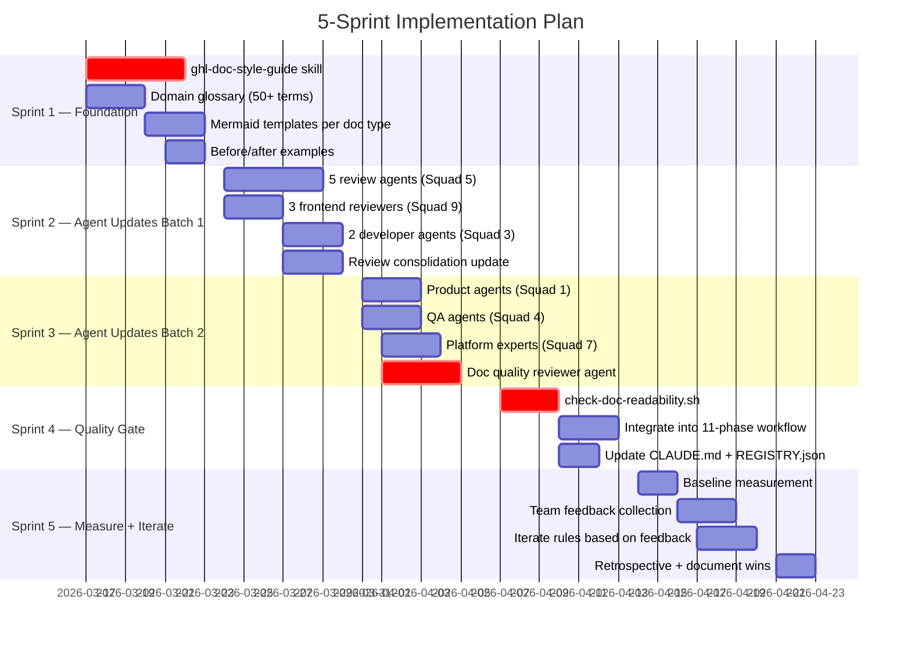
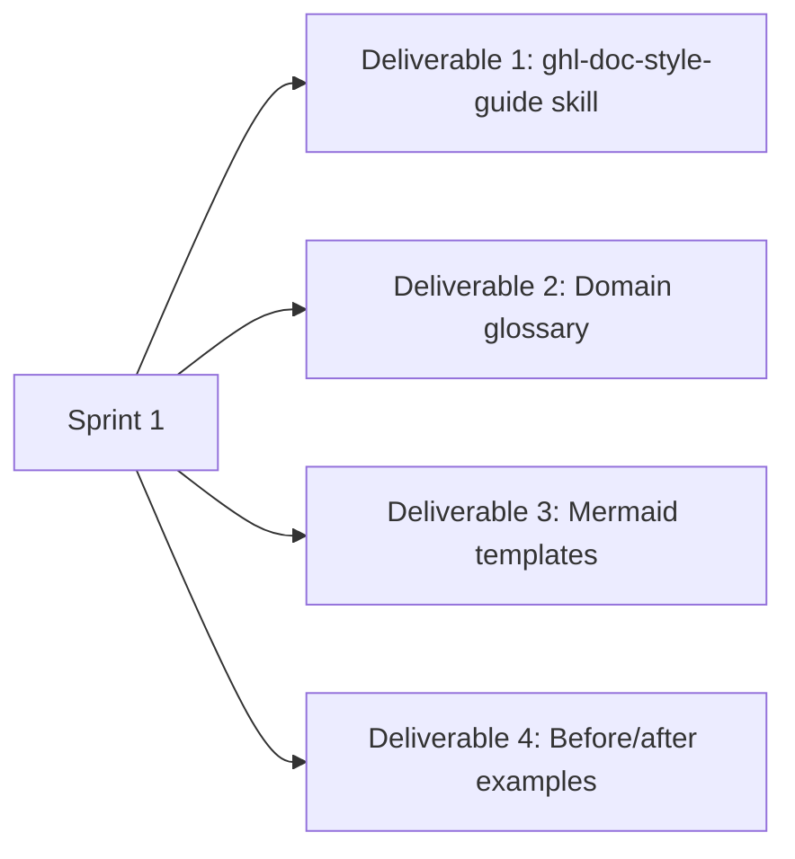
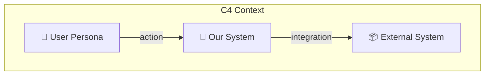
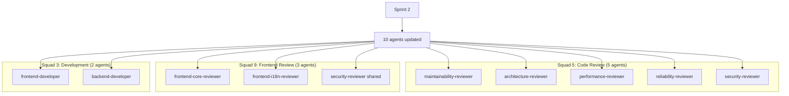
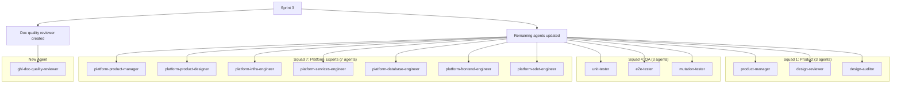
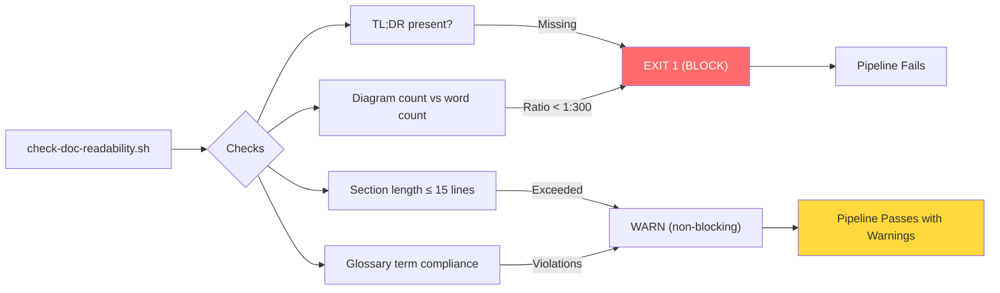
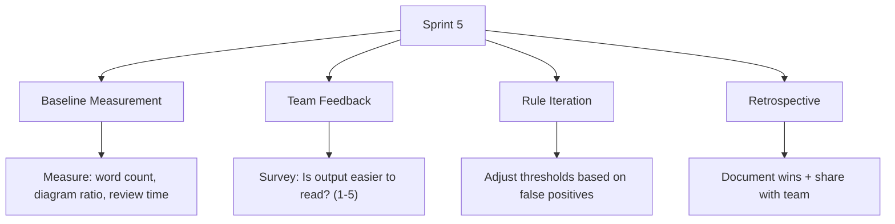
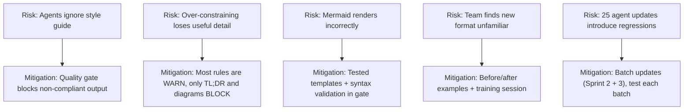
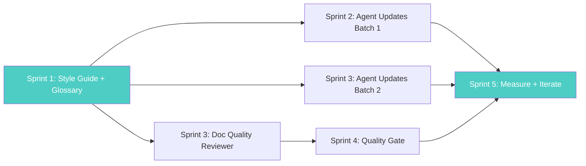

# Implementation Roadmap — AI Output Readability

> **TL;DR:** 5 sprints, 4 pillars. Sprint 1 creates the style guide + glossary (foundation). Sprint 2-3 updates all 25 agents. Sprint 3-4 builds the doc quality reviewer + gate. Sprint 5 measures and iterates.

---

## Roadmap at a Glance



---

## Sprint 1: Foundation (Week of Mar 17)

**Goal:** Create the rules that all agents will follow.



### Deliverable 1: `ghl-doc-style-guide` Skill

**File:** `.agentic-workspace/skills/ghl-doc-style-guide/SKILL.md`

```
Rule Categories:
├── Structure Rules
│   ├── Every doc starts with TL;DR (≤3 lines)
│   ├── Sections: TL;DR → Diagram → Key Points → Details
│   ├── Omit empty sections entirely
│   └── Headers use action verbs
│
├── Brevity Rules
│   ├── No paragraph > 4 lines
│   ├── No section > 15 lines without a visual
│   ├── Tables for comparisons (>2 items)
│   ├── Start with conclusion, then context
│   └── No filler phrases
│
├── Visual Rules
│   ├── Mermaid diagram FIRST for flows/relationships
│   ├── Min 1 diagram per 300 words
│   ├── Tables for structured data
│   └── Inline code annotations (not separate explanation)
│
├── Terminology Rules
│   ├── Domain glossary terms only
│   └── Never mix terms for same concept
│
└── Tone Rules
    ├── Write for the reader, not the author
    ├── Lead with what to DO
    └── Be direct — no hedging
```

### Deliverable 2: Domain Glossary

**File:** `.agentic-workspace/glossary.md`

| Canonical Term | Never Use | Definition |
|---------------|-----------|-----------|
| location | sub-account, client account, business | Multi-tenant scope unit under an agency |
| locationId | subAccountId, clientId, businessId | Primary tenant identifier (string) |
| agency | parent account, company, organization | Top-level account that owns locations |
| agencyId | parentId, companyId | Agency identifier (string) |
| pipeline | funnel, sales process, deal flow | Deal tracking workflow with stages |
| pipeline stage | deal stage, funnel step | Single step within a pipeline |
| Smart List | segment, filter group, saved search | Saved contact filter with dynamic membership |
| contact | lead, prospect, customer | Person record within a location |
| opportunity | deal, sale | Revenue-tracked item in a pipeline |
| workflow | automation, sequence, drip | Automated action sequence triggered by events |
| ... | ... | ≥50 terms total |

### Deliverable 3: Mermaid Templates

**Directory:** `.agentic-workspace/templates/mermaid/`

| Template File | Doc Type | Diagram Type |
|--------------|----------|-------------|
| `architecture.md` | Architecture docs | C4 Context + Container |
| `api-flow.md` | API specs | Sequence diagram |
| `data-flow.md` | Data flow docs | Flowchart LR |
| `decision.md` | ADRs | Decision tree |
| `review-summary.md` | Review reports | Pie chart + finding table |
| `user-flow.md` | User stories | Flowchart TD |
| `timeline.md` | Plans/roadmaps | Gantt chart |

**Example — Architecture Template:**



### Deliverable 4: Before/After Examples

Create 3 before/after comparisons showing the transformation:

| Example | Before (Current) | After (Target) |
|---------|-----------------|----------------|
| Spec excerpt | 500-word prose section | TL;DR + Mermaid flow + table |
| Review output | 5 separate verbose reports | 1 consolidated report with severity table |
| Architecture doc | ASCII text flows + paragraphs | C4 Mermaid diagram + brief context |

---

## Sprint 2: Agent Updates — Batch 1 (Week of Mar 24)

**Goal:** Update the most impactful agents first — review agents + developer agents.



### Changes Per Agent

**For each of the 10 agents, add to their `.md` definition:**

```yaml
# Add to skills list:
skills:
  - ghl-doc-style-guide  # NEW

# Add to rules:
rules:
  - Follow ghl-doc-style-guide for ALL markdown output
  - Start every report/doc with 3-line TL;DR
  - Include Mermaid diagram for any flow or relationship
  - Use domain glossary terms from glossary.md
  - Omit sections with no findings (don't say "No issues found")
  - Use severity table format for findings
```

**Review consolidation update to `ghl-code-review-pr` skill:**

```
Add consolidation step:
1. Collect all 5 reviewer outputs
2. Deduplicate: merge findings about same issue across reviewers
3. Normalize severity: map all reviewer scales to Critical/High/Medium/Low
4. Group by file (not by reviewer)
5. Output single report: Summary table → Grouped findings → Raw details (collapsed)
```

---

## Sprint 3: Agent Updates — Batch 2 + Doc Reviewer (Week of Mar 31)

**Goal:** Update remaining agents and build the doc quality reviewer.



### `ghl-doc-quality-reviewer` Agent Spec

```yaml
name: ghl-doc-quality-reviewer
type: reviewer
squad: 5 (Code Review — extended to docs)
skills:
  - ghl-doc-style-guide

checks:
  - id: TLDR_PRESENT
    rule: "First section must be TL;DR, ≤3 lines"
    severity: BLOCK

  - id: DIAGRAM_RATIO
    rule: "≥1 Mermaid diagram per 300 words"
    severity: BLOCK

  - id: SECTION_LENGTH
    rule: "No section > 15 lines without visual element"
    severity: WARN

  - id: PARAGRAPH_LENGTH
    rule: "No paragraph > 4 lines"
    severity: WARN

  - id: EMPTY_SECTIONS
    rule: "Remove sections with no substantive content"
    severity: WARN (auto-suggest removal)

  - id: GLOSSARY_COMPLIANCE
    rule: "All domain terms match glossary.md"
    severity: WARN

  - id: ACTION_VERB_HEADERS
    rule: "Section headers use action verbs"
    severity: INFO

verdict_logic:
  APPROVED: Zero BLOCKs
  CHANGES_REQUESTED: Any BLOCK present
```

---

## Sprint 4: Quality Gate + Workflow Integration (Week of Apr 7)

**Goal:** Automate enforcement so readability can't regress.



### Integration Points

| Integration | Where | How |
|------------|-------|-----|
| 11-phase workflow | Phase 4 (Implementation) | Run gate after each doc-producing step |
| Code review workflow | After `ghl-code-review-pr` | Run on consolidated review output |
| Spec validation | Phase 1 (Intake) | Extend `validate-spec.sh` with readability checks |
| CLAUDE.md | Agent roster table | Add `ghl-doc-quality-reviewer` to Squad 5 |
| REGISTRY.json | Agent registry | Auto-register new agent + skill |

---

## Sprint 5: Measure + Iterate (Week of Apr 14)

**Goal:** Prove it works, adjust what doesn't.



### Measurement Plan

| Metric | How to Measure | Baseline (Sprint 5) | Target (Sprint 8) |
|--------|---------------|:--------------------:|:------------------:|
| Avg doc word count | `wc -w` on agent output | Establish | **-50%** |
| Docs with diagrams | Count Mermaid blocks | ~4% (1/25 agents) | **100%** |
| PR review cycle time | Git analytics | Establish | **-30%** |
| "What does this mean?" comments | PR comment search | Establish | **-40%** |
| Developer satisfaction | Survey (1-5 scale) | Establish | **≥4.0** |
| Glossary compliance | Automated check | Establish | **>95%** |

---

## Risk Mitigation



---

## Dependencies



**Critical path:** Sprint 1 (Foundation) blocks everything. Start here.

---

## How to Start

```
# Option 1: Plan the implementation
/ghl:plan agentic-workspace-docs/research/2026-03-14-ai-output-readability/SPEC.md

# Option 2: Go full autonomous
/ghl:lfg

# Option 3: Start Sprint 1 manually
# Create the style guide skill first
```

---

*This roadmap follows the proposed style: Gantt for timeline, flowcharts for dependencies, tables for data, no section > 15 lines.*
