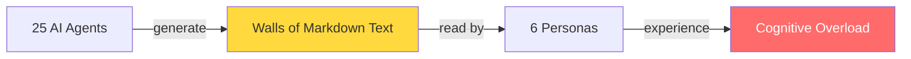
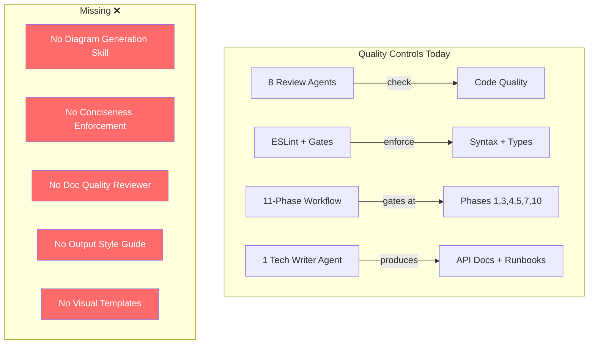
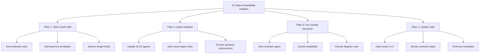
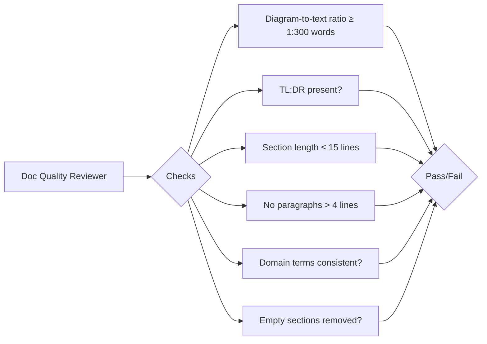
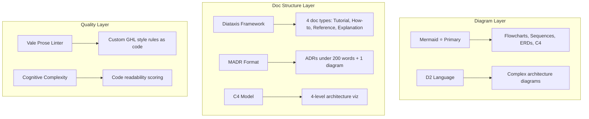
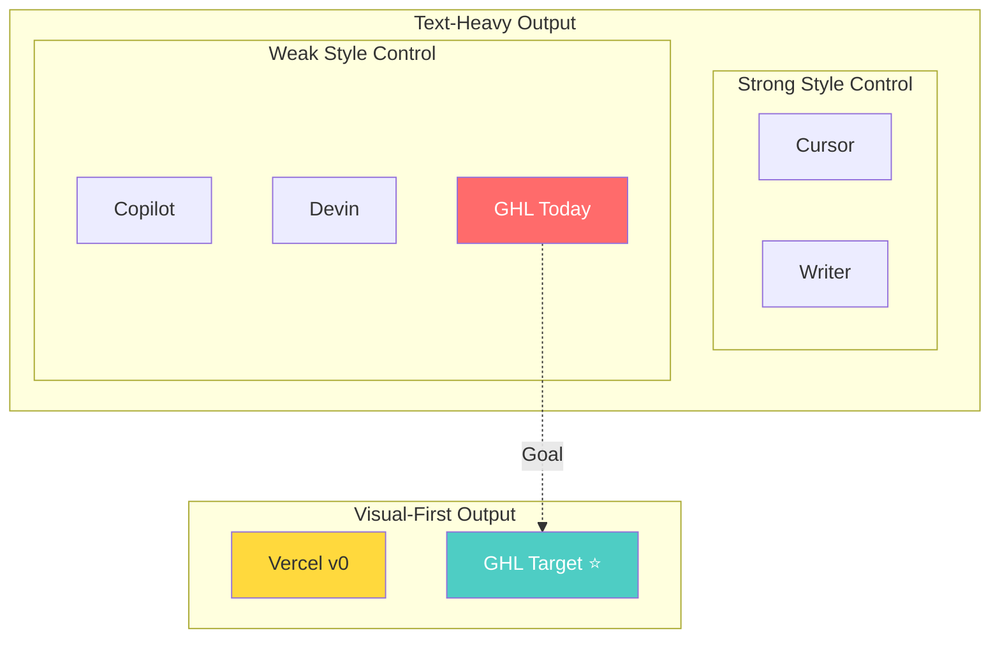
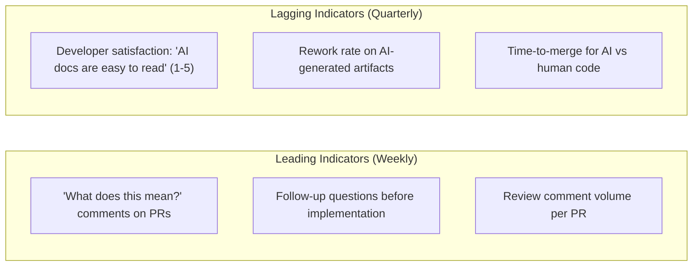
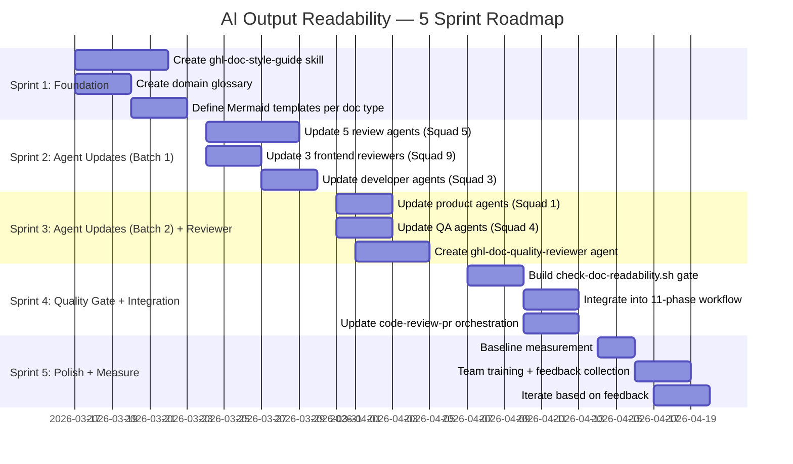

# AI Output Readability — Research Summary

> **TL;DR:** Our 25 agents produce working but hard-to-read output. The fix: enforce conciseness rules, add Mermaid diagrams everywhere, create a doc quality reviewer agent, and standardize output templates across all agents.

---

## The Problem in One Diagram



**Current state:** Every agent formats independently. No conciseness rules. Only 1 Mermaid diagram in the entire codebase. Output is comprehensive but exhausting to read.

---

## Who's Affected

| Persona | Share | Volume |
|---------|:-----:|--------|
| Developers (code + reviews) | **35%** | ████████████████░░░░ |
| Product Managers (specs + PRDs) | **20%** | █████████░░░░░░░░░░░ |
| QA Engineers (test scenarios) | **15%** | ███████░░░░░░░░░░░░░ |
| Design Reviewers (audit reports) | **10%** | █████░░░░░░░░░░░░░░░ |
| Leadership (summaries) | **10%** | █████░░░░░░░░░░░░░░░ |
| New Members (onboarding docs) | **10%** | █████░░░░░░░░░░░░░░░ |

---

## Top 10 Pain Points

| # | Pain Point | Severity | Who Feels It |
|---|-----------|:--------:|-------------|
| 1 | Inconsistent domain terms ("sub-account" vs "location" vs "client") | **Critical** | Everyone |
| 2 | Too verbose — 500 lines when 100 would do | **High** | Everyone |
| 3 | Generic code naming (`data`, `item` vs `locationContacts`, `pipelineStage`) | **High** | Developers, QA |
| 4 | No TL;DR — must read everything to find the key point | **High** | PMs, Leadership |
| 5 | 5 review agents duplicate findings without consolidation | **High** | Developers |
| 6 | Inconsistent formatting across 25 agents | **High** | Everyone |
| 7 | Empty boilerplate sections ("Risk: None identified") | **Medium** | PMs, Developers |
| 8 | Test names describe mechanism, not behavior | **Medium** | QA |
| 9 | No progressive disclosure in docs | **Low** | New Members |
| 10 | Data claims without source attribution | **Low** | Leadership |

---

## Current State Audit

### What Exists



### Existing Doc Pipeline (Text-Only)

| Component | Count | Visualization? |
|-----------|:-----:|:--------------:|
| Technical Writer Agent | 1 | None |
| Summarization Skills | 3 | None |
| Mermaid Diagrams | **1** (only in swarm.md) | Minimal |
| Chart/Metric Visuals | 0 | None |
| Visual Templates | 0 | None |
| Output Style Guide | 0 | None |

---

## The Solution — 4 Pillars



### Pillar Breakdown

#### Pillar 1: `ghl-doc-style-guide` Skill (Sprint 1)

**What it does:** A shared skill consumed by ALL agents that enforces:

```
RULES:
├── Every doc starts with a 3-line TL;DR
├── Every concept with flow/relationships → Mermaid diagram FIRST
├── Tables for comparisons (never prose for >2 items)
├── No paragraph > 4 lines
├── No section > 15 lines without a visual
├── Headers use action verbs ("Configure Redis" not "Redis Configuration")
├── Omit empty sections entirely
├── Start sections with conclusion, not context
├── Max 1 accent emoji per section header (optional)
└── Domain terms from enforced glossary only
```

#### Pillar 2: Update All 25 Agent Definitions (Sprint 2-3)

**What changes per agent:**

| Agent Type | Current Output | New Output |
|-----------|---------------|------------|
| Developer agents | Code + verbose explanation | Code + 3-line summary + Mermaid flow |
| Review agents | Long prose findings | Severity table + consolidated findings |
| Product agents | Text-heavy specs/PRDs | TL;DR + Mermaid user flows + tables |
| QA agents | Mechanism-named tests | Behavior-named tests + coverage diagram |
| Architect agent | Text data flows | Mermaid C4 diagrams + decision tables |
| Tech writer agent | Prose docs | Visual-first docs with Mermaid + tables |

#### Pillar 3: `ghl-doc-quality-reviewer` Agent (Sprint 3)

**New agent that reviews all doc output for:**



#### Pillar 4: Quality Gate Script (Sprint 3-4)

**`scripts/gates/check-doc-readability.sh`** — automated enforcement:

| Check | Threshold | Action |
|-------|-----------|--------|
| Word count per section | Max 200 words | WARN if exceeded |
| Mermaid diagram count | Min 1 per 300 words | BLOCK if missing |
| TL;DR present | Required at top | BLOCK if absent |
| Paragraph length | Max 4 lines | WARN if exceeded |
| Domain glossary compliance | 100% match | WARN on violations |
| Empty section detection | 0 allowed | Auto-remove |

---

## Frameworks & Tools to Adopt



| Tool | Purpose | Integration Effort | Priority |
|------|---------|:------------------:|:--------:|
| **Mermaid** | Diagrams in markdown (GitHub/VSCode native) | Low | **P0** |
| **Diataxis** | Doc type categorization | Low | **P0** |
| **MADR** | Concise ADR format | Low | **P1** |
| **C4 Model** | Architecture diagrams via Mermaid C4 | Low | **P1** |
| **D2** | Complex architecture diagrams | Medium | **P2** |
| **Vale** | Prose linting as code | Medium | **P2** |

---

## Competitive Landscape



**Key insight:** No competitor does readability-as-a-first-class-metric for multi-agent systems. This is a gap we can own.

| Competitor | Approach | Strength | Weakness |
|-----------|----------|----------|----------|
| **Cursor** | `.cursorrules` for style enforcement | Teams control conventions | Free-text rules, no validation |
| **Writer** | Brand voice scoring against style guides | Most mature quality scoring | Marketing-focused, expensive |
| **Vercel v0** | Consistent shadcn/ui output | Clean, idiomatic code | React-only, no codebase adaptation |
| **Copilot** | Relies on existing linters | Matches repo style via context | No readability scoring |
| **Devin** | Step-by-step reasoning shown | Shows work transparently | Verbose, no style enforcement |

---

## Success Metrics



| Metric | Baseline | Target | How to Measure |
|--------|:--------:|:------:|---------------|
| PR review cycle time | Establish | **-30%** | Git analytics |
| Domain term consistency | ~60% | **>95%** | Automated glossary lint |
| Artifact scan time | Establish | **-40%** | Timed user testing |
| Review deduplication | 0% | **>80%** | Pre/post finding comparison |
| Docs with Mermaid diagrams | **4%** (1/25 agents) | **100%** | Template compliance check |
| Avg doc word count | Establish | **-50%** | Automated word count |

---

## Implementation Timeline



---

## What's Next

| Action | Command |
|--------|---------|
| See competitive deep-dive | Read `COMPETITIVE_ANALYSIS.md` |
| See full spec with acceptance criteria | Read `SPEC.md` |
| See current codebase audit | Read `CODEBASE_AUDIT.md` |
| See detailed implementation plan | Read `IMPLEMENTATION_ROADMAP.md` |
| Start implementation | `/ghl:plan SPEC.md` |
| Go full auto | `/ghl:lfg` with SPEC.md |

---

*This document itself follows the proposed style: TL;DR first, Mermaid diagrams for every concept, tables instead of prose, no section > 15 lines.*
