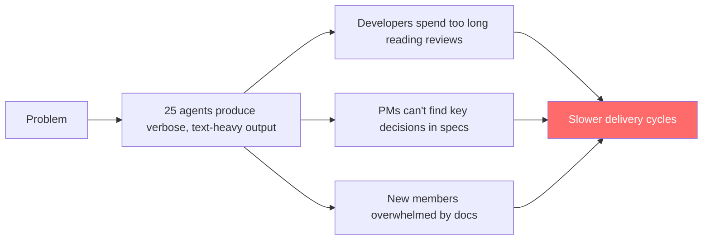
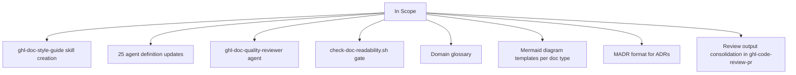
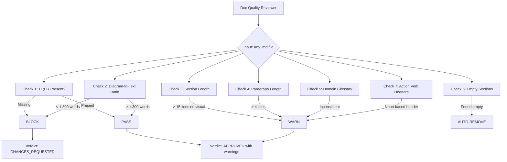
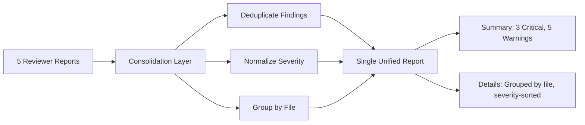

---
task_id: READABILITY-001
title: "AI Output Readability — Visual-First, Concise Agent Output"
type: feature
complexity: L
has_ui_changes: false
has_api_changes: false
has_db_changes: false
squad_impact: [1, 2, 3, 4, 5, 7, 8, 9]
---

# SPEC: AI Output Readability

> **TL;DR:** Make all 25 agents produce concise, visual-first documentation by creating a shared style guide skill, updating every agent definition, building a doc quality reviewer agent, and adding a readability quality gate.

---

## 1. Business Context

**Measurable outcome:** Reduce time-to-understand AI-generated artifacts by 40%, measured by PR review cycle time and follow-up question frequency.



**Why now:** AI-generated output volume is growing. Without readability standards, cognitive load compounds with every new agent and every sprint.

---

## 2. User Stories

| # | Story | Persona |
|---|-------|---------|
| 1 | As a **developer**, I want review comments consolidated and scannable, so I can fix issues without reading 5 separate reports | Developer |
| 2 | As a **PM**, I want specs with a TL;DR and diagrams, so I can make decisions without reading 500 lines | Product Manager |
| 3 | As a **QA engineer**, I want test names that describe behavior, so I can understand what's tested at a glance | QA Engineer |
| 4 | As a **new team member**, I want docs with progressive disclosure, so I can learn at my own pace | New Member |
| 5 | As a **leader**, I want summaries proportional to insight density, so I only read what matters | Leadership |

---

## 3. Acceptance Criteria

### Functional

| # | Criterion | Pass/Fail Test |
|---|-----------|---------------|
| AC1 | `ghl-doc-style-guide` skill exists and is consumable by all agents | Skill file exists at `.agentic-workspace/skills/ghl-doc-style-guide/SKILL.md` with anti-verbosity rules, Mermaid requirements, and section limits |
| AC2 | All 25 agent definitions reference `ghl-doc-style-guide` in their skills list | `grep -c "ghl-doc-style-guide"` across all agent `.md` files = 25 |
| AC3 | `ghl-doc-quality-reviewer` agent exists with readability checks | Agent file at `.agentic-workspace/agents/ghl-doc-quality-reviewer.md` with diagram ratio, TL;DR, section length, and glossary checks |
| AC4 | Quality gate script `check-doc-readability.sh` exists and runs in CI | Script at `scripts/gates/check-doc-readability.sh`, exits 0 on pass, 1 on fail |
| AC5 | Domain glossary file exists with ≥50 GHL terms | File at `.agentic-workspace/glossary.md` with term → canonical name mapping |
| AC6 | Every agent-generated doc includes ≥1 Mermaid diagram per 300 words | Doc quality reviewer checks this ratio and BLOCKS if missing |
| AC7 | Every agent-generated doc starts with a TL;DR (≤3 lines) | Doc quality reviewer checks first section is TL;DR and BLOCKS if absent |

### Non-Functional

| # | Criterion | Threshold |
|---|-----------|-----------|
| NF1 | Agent prompt size increase | ≤500 tokens added per agent (style guide is a linked skill, not inlined) |
| NF2 | Quality gate execution time | ≤5 seconds per document |
| NF3 | Zero false-positive blocks | Gate warnings on edge cases, blocks only on clear violations |

---

## 4. Scope

### In Scope



### Out of Scope

| Item | Why |
|------|-----|
| Code readability scoring (SonarQube/CodeClimate) | Separate initiative — code quality vs. doc quality |
| Vale prose linter integration | P2 — good enhancement but not MVP |
| D2 language support | P2 — Mermaid covers 90% of needs |
| Eraser.io API integration | P3 — nice-to-have, not essential |
| Automated readability feedback loop | P2 — requires usage tracking infrastructure |
| End-user facing documentation changes | This is internal agent output only |

---

## 5. Deliverables

### Deliverable 1: `ghl-doc-style-guide` Skill

```
.agentic-workspace/skills/ghl-doc-style-guide/SKILL.md
```

**Core rules this skill enforces:**

```yaml
structure:
  - Every doc starts with TL;DR (≤3 lines)
  - Sections follow: TL;DR → Diagram → Key Points → Details
  - Empty sections are omitted entirely
  - Headers use action verbs ("Configure X" not "X Configuration")

brevity:
  - No paragraph > 4 lines
  - No section > 15 lines without a visual element
  - Tables for comparisons (never prose for >2 items)
  - Start with conclusion, then context (inverted pyramid)
  - No introductory phrases ("In this document, we will...")

visuals:
  - Every flow/relationship → Mermaid diagram FIRST, text SECOND
  - Minimum 1 Mermaid diagram per 300 words
  - Use tables for all structured data
  - Code examples annotated inline (not explained in separate paragraphs)

terminology:
  - Use domain glossary terms only (linked from glossary.md)
  - Never mix terms for same concept in one document

tone:
  - Write for the engineer at 2am, not the author who knows the answer
  - Lead with what the reader needs to DO, not background
  - No hedging ("might", "could potentially") — be direct
```

### Deliverable 2: Agent Definition Updates

**What changes in each agent `.md` file:**

```diff
  skills:
    - ghl-backend-development
    - ghl-platform-services-inter-service-communication
+   - ghl-doc-style-guide

  rules:
+   - Follow ghl-doc-style-guide for ALL markdown output
+   - Every response with >100 words MUST include a Mermaid diagram
+   - Use domain glossary terms — check glossary.md
+   - Start every document/report with a 3-line TL;DR
+   - Omit sections with no substantive content
```

### Deliverable 3: `ghl-doc-quality-reviewer` Agent



### Deliverable 4: Quality Gate Script

```bash
# scripts/gates/check-doc-readability.sh
# Checks: TL;DR, diagram ratio, section length, glossary compliance
# Exit 0 = pass, Exit 1 = fail
```

### Deliverable 5: Domain Glossary

```
.agentic-workspace/glossary.md
```

| Canonical Term | Never Use | Context |
|---------------|-----------|---------|
| `location` | sub-account, client account, business | Multi-tenant scope unit |
| `locationId` | subAccountId, clientId | Primary tenant identifier |
| `agency` | parent account, company | Top-level account |
| `pipeline` | funnel, sales process | Deal tracking workflow |
| `Smart List` | segment, filter group | Saved contact filter |
| ... | ... | ≥50 terms total |

### Deliverable 6: Mermaid Templates

Per doc type, provide starter Mermaid templates:

| Doc Type | Recommended Diagram | Template |
|----------|-------------------|----------|
| Architecture doc | C4 Context + Container | `graph TD` with service boxes |
| API spec | Sequence diagram | `sequenceDiagram` with request/response |
| Data flow | Flowchart | `graph LR` with transformations |
| Decision record | Decision tree | `graph TD` with options + trade-offs |
| Review report | Summary pie chart | `pie title` with finding categories |
| Sprint plan | Gantt chart | `gantt` with task timeline |
| User flow | Flowchart | `graph TD` with user actions |

### Deliverable 7: Review Consolidation Update

Update `ghl-code-review-pr` skill to:



---

## 6. Test Scenarios

| # | Scenario | Type | Expected Result |
|---|----------|------|----------------|
| T1 | Agent generates a spec without TL;DR | Error | Doc quality reviewer BLOCKS, requests TL;DR |
| T2 | Agent generates 600-word doc with 0 diagrams | Error | Doc quality reviewer BLOCKS, requires ≥2 Mermaid diagrams |
| T3 | Agent generates doc with "sub-account" instead of "location" | Edge | Doc quality reviewer WARNS, suggests glossary term |
| T4 | Agent generates review with all passing checks listed | Edge | Doc quality reviewer WARNS about verbosity |
| T5 | Agent generates well-formatted doc with TL;DR + diagrams | Happy | Doc quality reviewer APPROVES |
| T6 | 5 code reviewers produce findings with overlapping issues | Happy | Consolidation layer deduplicates to unique findings only |
| T7 | Gate script runs on a 2000-word doc | Happy | Completes in <5 seconds |

---

## 7. Risks

| Risk | Likelihood | Impact | Mitigation |
|------|:----------:|:------:|-----------|
| Agents ignore style guide skill | Medium | High | Make it a hard dependency — gate script enforces |
| Mermaid diagrams render incorrectly | Low | Medium | Provide tested templates; review agent validates syntax |
| Over-constraining reduces useful detail | Medium | Medium | WARN (not BLOCK) on most rules; only BLOCK on TL;DR and diagram ratio |
| Agent prompt size bloat | Low | Low | Style guide is a linked skill reference, not inlined content |
| Team resistance to new format | Low | Medium | Show before/after examples; make it obviously better |

---

## 8. Files Affected

| File/Pattern | Change Type | Description |
|-------------|:-----------:|-------------|
| `.agentic-workspace/skills/ghl-doc-style-guide/SKILL.md` | **New** | Style guide skill definition |
| `.agentic-workspace/agents/*.md` (25 files) | **Modify** | Add `ghl-doc-style-guide` to skills + output rules |
| `.agentic-workspace/agents/ghl-doc-quality-reviewer.md` | **New** | Doc quality reviewer agent |
| `.agentic-workspace/glossary.md` | **New** | Domain term glossary |
| `scripts/gates/check-doc-readability.sh` | **New** | Readability quality gate |
| `.agentic-workspace/skills/ghl-code-review-pr/SKILL.md` | **Modify** | Add consolidation rules |
| `.agentic-workspace/templates/mermaid/` | **New** | Mermaid diagram templates per doc type |
| `CLAUDE.md` | **Modify** | Add doc-quality-reviewer to agent roster |

---

## 9. Competitive Reference

| What competitors do | How we differentiate |
|--------------------|---------------------|
| Cursor: `.cursorrules` for code style | We enforce doc + code style across 25 agents |
| Writer: Brand voice scoring | We score engineering docs, not marketing copy |
| Nobody: Multi-agent readability system | First to make readability a metric across an agent ecosystem |
| Nobody: Visual-first doc enforcement | First to require Mermaid diagrams as a quality gate |

---

*This spec follows the proposed style: TL;DR, Mermaid diagrams, tables over prose, no section > 15 lines.*
