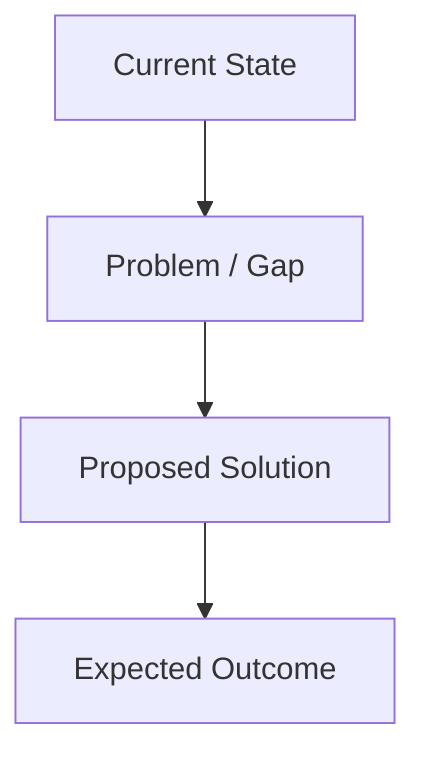
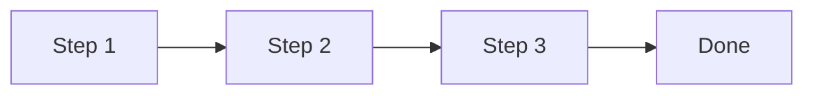

# Document Title

> **TL;DR:** 1-3 sentences summarizing the key point. What changed, why it matters, what to do next.

---

## Context

---

## Key Findings

| Finding | Impact | Evidence |
|---------|--------|----------|
| ... | High / Medium / Low | Data source or observation |
| ... | ... | ... |

---

## Proposal

> One clear recommendation in 1-2 sentences.

---

## Trade-offs

| Option | Pros | Cons |
|--------|------|------|
| A | ... | ... |
| B | ... | ... |

---

## Next Steps

| Action | Owner | Status |
|--------|-------|--------|
| ... | ... | Pending |
| ... | ... | Pending |

---

<!-- Giscus comments load automatically below -->
